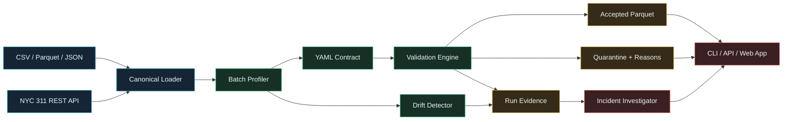

# PipeProof

[](https://www.python.org/)
[](https://github.com/Robertcurzon/pipeproof/actions)
[](https://www.starlette.io/)
[](https://arrow.apache.org/)
[](LICENSE)

**PipeProof** is a contract-first data intake and pipeline reliability workbench. It turns changing CSV, Parquet, JSON, and REST feeds into validated datasets with explicit contracts, row-level quarantine evidence, baseline drift detection, and reproducible run artifacts.

It is built for data engineers, analytics engineers, consultants, and SaaS teams that regularly receive customer, vendor, or operational data they do not fully control.

## Why PipeProof

An external feed can be syntactically valid and still be unsafe to publish. A source may rename a field, change a number into text, duplicate primary keys, introduce new categories, shrink unexpectedly, or shift its distribution without warning.

PipeProof places a quality gate between incoming data and downstream consumers:

- Profiles schemas, distributions, null rates, cardinality, and likely PII fields.
- Generates a readable, versioned YAML contract from an accepted baseline.
- Validates types, required fields, uniqueness, ranges, categories, and patterns.
- Detects schema, volume, null-rate, numeric, and categorical drift.
- Splits every batch into accepted and quarantined outputs.
- Records row-level failure reasons instead of silently dropping bad records.
- Produces a bounded incident investigation based only on observed evidence.
- Works through an installable CLI, JSON API, browser interface, or GitHub Action.
- Stores clean data in Parquet when Apache Arrow is available, with CSV fallback.

The bundled demo replays an incident using an anonymized fixture modeled on NYC 311 service-request data. A separate connector can fetch current records directly from the public NYC Open Data API.

## Architecture



The validation package is independent from the web application. The CLI, API, browser UI, tests, and GitHub Action all call the same pipeline service.

## Quickstart

```bash
git clone https://github.com/Robertcurzon/pipeproof.git
cd pipeproof
python -m venv .venv
source .venv/bin/activate
pip install -r requirements.txt
uvicorn web.app:app --reload
```

Open [http://localhost:8000](http://localhost:8000). The first request creates a complete incident replay, so the dashboard is useful before any files are uploaded.

Claude is optional. Without `ANTHROPIC_API_KEY`, PipeProof uses the same deterministic evidence and remediation engine shown in the public demo. To enable narrative enrichment, copy `.env.example` to `.env` and add the key before starting the app.

## Analyze Your Data

PipeProof is schema-agnostic. Upload a baseline batch representing the last accepted state and a current batch that should be evaluated. Both files should represent the same logical dataset.

Supported formats:

| Format | Extension | Notes |
|---|---|---|
| CSV | `.csv` | Header row required |
| Parquet | `.parquet` | Recommended for typed or larger batches |
| JSON records | `.json` | Array or table-shaped records |
| JSON Lines | `.jsonl` | One object per line |

Input guidance:

- Keep one field per column and one record per row.
- Use stable column names and ISO 8601 dates where possible.
- Include a unique identifier such as `record_id`, `order_id`, or `unique_key` when available.
- Use the baseline to establish accepted categories, numeric ranges, nullability, and uniqueness.
- The hosted upload form is limited to 25 MB. The CLI has no application-level size limit.

When no baseline is supplied, PipeProof treats the current file as the initial accepted state and generates contract version `1.0.0`.

See [the contract guide](docs/data-contracts.md) for inference rules and customization details.

## CLI

Generate a contract:

```bash
pipeproof contract data/sample/nyc_311_baseline.csv \
  --name nyc_311_service_requests \
  --output contract.yaml
```

Run a reliability check:

```bash
pipeproof check data/sample/nyc_311_incident.csv \
  --baseline data/sample/nyc_311_baseline.csv \
  --name nyc_311_service_requests
```

Replay the bundled incident:

```bash
pipeproof demo
```

Fetch current public data:

```bash
pipeproof fetch-nyc-311 --days 7 --limit 2000
```

The `check` command exits with status `1` when blocking checks fail, making it suitable for CI quality gates.

## GitHub Action

PipeProof includes a composite action that can block publication when an incoming batch violates its contract:

```yaml
- uses: Robertcurzon/pipeproof@main
  with:
    baseline: data/accepted/orders.csv
    current: data/incoming/orders.csv
    dataset-name: customer_orders
```

Run artifacts include:

```text
data/runtime/runs/<run-id>/
├── manifest.json
├── contract.yaml
├── baseline_profile.json
├── current_profile.json
├── validation.json
├── drift.json
├── investigation.json
├── accepted.parquet
└── quarantined.parquet
```

## JSON API

| Endpoint | Purpose |
|---|---|
| `GET /health` | Deployment health check |
| `GET /api/runs` | Run-history manifests |
| `GET /api/runs/{run_id}` | Complete evidence for one run |
| `POST /analyze` | Browser multipart upload workflow |
| `GET /artifacts/{run_id}/{filename}` | Whitelisted artifact download |

## Incident Investigator

The deterministic investigator is the system of record. It ranks blocking checks and drift signals, reports the exact evidence, and recommends bounded next actions.

When Claude is enabled, only the structured incident evidence is sent for narrative enrichment. Raw uploaded rows are never included. The model is explicitly prohibited from changing measurements or inventing root causes, and the evidence remains visible beside the narrative.

## Public Deployment

`render.yaml` contains a one-click-friendly Render service definition. The same command works on Railway or another Python host:

```bash
uvicorn web.app:app --host 0.0.0.0 --port $PORT
```

Ephemeral free hosting is appropriate for the demo. For durable production run history, point `PIPEPROOF_DATA_DIR` at persistent storage or replace `ArtifactStore` with an object-store implementation.

## Engineering Quality

```bash
pip install -e ".[dev]"
ruff check .
pytest --cov=pipeproof --cov-report=term-missing
```

CI tests Python 3.11 and 3.12 on every push and pull request.

## Roadmap

- Editable contract approval and semantic versioning workflow.
- dlt adapters for incremental REST, SQL, and cloud-file ingestion.
- Dagster assets and blocking asset checks.
- dbt-duckdb transformation examples and downstream impact graph.
- S3-compatible artifact storage and signed downloads.
- Slack and GitHub incident delivery with explicit human approval.

## License

[MIT](LICENSE)
